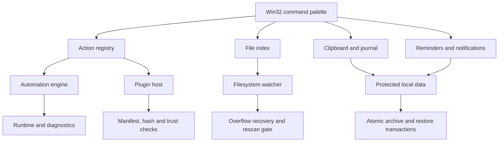

<p align="center">
  
</p>

# Axiom Desktop

[Türkçe](README.tr.md)

Axiom Desktop is a native, local-first command center for Windows. A global
`Alt+Space` palette brings file search, clipboard history, notes, reminders,
automations, diagnostics, and trusted native plugins into one keyboard-driven
workflow.

The project focuses on the engineering behind a dependable resident desktop
tool: filesystem change recovery, atomic local-data operations, explicit plugin
trust, crash-safe restore transactions, time-change handling, privacy-aware
support bundles, and deterministic tests around those boundaries.

> **Project context:** Axiom Desktop is an independent native Windows project
> developed while I was a high-school student. Its reliability claims are backed
> by the source, automated tests, and a structured Windows verification record.


*Real Release-build capture after `Alt+Space` → `diag status`. The palette shows
the command's session-scoped execution diagnostics.*

## Highlights

- Native C++20 and Win32; no embedded browser runtime.
- Global command palette with tray and single-instance lifecycle behavior.
- Incremental file indexing with `ReadDirectoryChangesW` recovery and rescan
  generation guards.
- Clipboard history, journal entries, reminders, notifications, and scheduled
  command automations.
- Local archive/restore with CurrentUser DPAPI protection and crash-recovery
  transactions.
- Native plugin manifests, SHA-256 verification, capability declarations, and a
  local trust store.
- Redacted support bundles and execution diagnostics.
- 30 registered CTest targets plus a Windows release-evidence verifier.

## How it is built

Axiom is a resident Win32 application rather than a web interface in a desktop
wrapper. The tray and single-instance lifecycle keep one process available;
`Alt+Space` opens a palette that routes typed commands through an action
registry. Search, local records, reminders, automation, plugins, and diagnostics
remain distinct subsystems behind that common entry point.

The less visible work is recovery and trust. File indexing does not assume
that every filesystem notification arrives: watcher loss can trigger a
generation-guarded rescan. Local archive/restore uses atomic transactions and
CurrentUser DPAPI protection where enabled. A plugin's manifest, requested
capabilities, package hash, and local trust decision are checked before loading
native code. These measures make failures and trust choices inspectable, but
they do not turn in-process plugins into a security sandbox.

## Architecture



See [Architecture](docs/ARCHITECTURE.md) for subsystem boundaries and failure
handling.

## What happens in a real session

Axiom starts as a single resident Windows process. Its notification-area icon
keeps the tool reachable without leaving a full window open. `Alt+Space`, tray
activation, or a second-instance handoff reveals the same palette. Typing a
command selects an entry from the action registry; the palette then presents
that action's result rather than owning each subsystem's business logic.
`diag status` is a small, safe way to inspect this path: it reports bounded,
session-scoped executor counts without persisting action payloads.

File search has a separate reliability problem. The index consumes incremental
Windows filesystem notifications, but notifications can be lost or overflow.
Watcher health records that condition and requests a rescan. Generation guards
prevent an old scan from clearing a newer recovery request. That choice matters
for a long-running command palette: returning stale search results as if the
index were healthy would be more misleading than acknowledging recovery.

Persistence and plugins have similarly explicit boundaries. Clipboard,
journal, reminder, automation, settings, and trust data stay local. Archive
restore records its intent so startup can roll back unfinished work or finish
cleanup after an interrupted commit; optional CurrentUser DPAPI protection is
tied to the Windows user, not portable across accounts. A native plugin first
passes manifest, ABI, capability, hash, and local trust checks. It still runs
inside Axiom's process, so the documented trust decision is important: this is
not arbitrary-code isolation.

### Where to read the implementation

| File | What to inspect |
| --- | --- |
| [`src/axiom.cpp`](src/axiom.cpp) | Win32 palette, tray, hotkey, and single-instance shell. |
| [`src/action_registry.cpp`](src/action_registry.cpp) | Shared command registration and dispatch boundary. |
| [`src/file_index.cpp`](src/file_index.cpp) | Searchable file metadata and index updates. |
| [`src/watcher_resync.cpp`](src/watcher_resync.cpp) and [`src/index_scan_gate.cpp`](src/index_scan_gate.cpp) | Watcher recovery and stale-scan guards. |
| [`src/restore_transaction.cpp`](src/restore_transaction.cpp) | Interrupted restore transaction handling. |
| [`src/plugin_host.cpp`](src/plugin_host.cpp) | Native plugin lifecycle and trust boundary. |
| [`tests/watcher_resync_tests.cpp`](tests/watcher_resync_tests.cpp) | A concrete recovery regression test. |

## A 60-second product tour

1. Start `Axiom.exe` and press `Alt+Space`. Type `?` to browse the command
   library.
2. Run `diag status` to see the session-scoped result pictured above.
3. Run `index status` to inspect the file index and watcher recovery state.
4. Run `plugin status` and `data status` to inspect plugin trust and local-data
   privacy state without changing either.
5. Search your own indexed files with `find <query>`; `help remind` and
   `help auto` show the persistent reminder and automation commands.

The first four commands are read-only and make the palette's subsystem
boundaries inspectable in a fresh installation.

## Build on Windows

### Prerequisites

- Windows 10 or later, x64
- Visual Studio 2022 with the Desktop development with C++ workload
- CMake 3.24 or later

From an x64 Visual Studio Developer PowerShell:

```powershell
cmake -S . -B build -A x64
cmake --build build --config Release
ctest --test-dir build -C Release --output-on-failure
```

The desktop executable is produced at `build/Release/Axiom.exe`. Start it once,
then use `Alt+Space` or the tray icon to show the palette.

## Repository layout

| Path | Purpose |
| --- | --- |
| `src/` | Win32 application and independently testable core libraries |
| `tests/` | Unit, contract, recovery, privacy, and Windows release-gate tests |
| `samples/hello_plugin/` | Minimal native plugin and manifest |
| `benchmarks/` | File-index benchmark target |
| `tools/` | Verification-evidence parser and gate checker |
| `verification-evidence/` | Structured Windows v0.16 release-gate record |
| `docs/` | Architecture and validation boundary |

## Plugin model

The sample plugin demonstrates the package boundary without hiding it behind a
framework. A manifest declares the plugin identity, ABI, DLL, and requested
capabilities. Installation and loading remain separate operations: package
hashing and local trust decisions happen before native code is loaded.

Native plugins execute in-process and therefore must be treated as trusted code.
The trust model reduces accidental or unreviewed loading; it is not a sandbox.

## Data and privacy

Axiom is local-first. Journal and archive protection uses Windows CurrentUser
DPAPI where enabled. Support-bundle fields are redacted by default and additional
data requires explicit opt-in. No cloud account or remote service is required by
the current source tree.

## Validation status

The v0.16 source candidate builds with Visual Studio 2022/MSVC and passes all 30
CTest targets. The included structured evidence also covers lifecycle,
single-instance activation, tray/hotkey behavior, plugin install/load/unload,
DPAPI round-trips, watcher recovery, clock/DST changes, crash recovery, and
support-bundle publication.

See [Validation evidence](docs/VALIDATION.md) for what was reproduced locally
and the boundary between the real palette capture and structured lifecycle
evidence.

## Scope boundaries

Axiom is a portfolio-stage Windows desktop system, not a security boundary or an
enterprise endpoint-management product. Plugin trust, local encryption, and
recovery logic are implemented and tested, but the project does not claim formal
security certification.

Current portfolio release: **0.16.0**.

## License

Licensed under the [MIT License](LICENSE).

Small, reviewable changes are welcome; see [CONTRIBUTING.md](CONTRIBUTING.md) for
the local quality gate.
