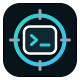
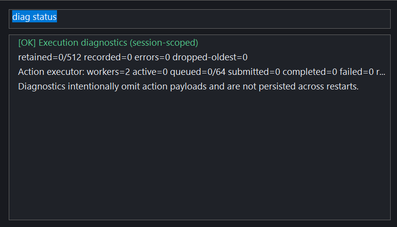
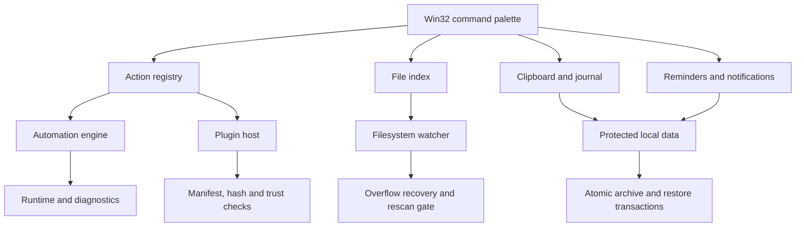

<p align="center">
  
</p>

# Axiom Desktop

[English](README.md)

Axiom Desktop, Windows için native ve local-first bir komuta merkezidir. Global `Alt+Space` paleti; dosya arama, clipboard geçmişi, notlar, hatırlatmalar, otomasyonlar, tanılar ve güvenilen native plugin’leri klavyeyle kullanılan tek bir akışta toplar.

Projenin mühendislik odağı, arka planda sürekli çalışan bir masaüstü aracının güvenilirliğidir: dosya sistemi değişikliklerinden toparlanma, atomik yerel veri işlemleri, açık plugin güven modeli, çökme sonrası restore işlemleri, saat değişiklikleri, mahremiyeti gözeten destek paketleri ve bu sınırları sınayan deterministik testler.

> **Proje bağlamı:** Axiom Desktop, lise yıllarımda geliştirdiğim bağımsız bir native Windows projesidir. Güvenilirlik iddiaları kaynak kod, otomatik testler ve yapılandırılmış Windows doğrulama kaydıyla sınırlandırılmıştır.



*`Alt+Space` → `diag status` sonrasında çalışan Release uygulamasından alınmış
gerçek ekran görüntüsü. Palet, komutun oturuma özgü yürütme tanılarını gösterir.*

## Öne çıkanlar

- Native C++20 ve Win32; gömülü tarayıcı runtime’ı yok.
- Tray ve tek-instance yaşam döngüsüyle çalışan global komut paleti.
- `ReadDirectoryChangesW` kaybından toparlanabilen artımlı dosya indeksleme ve rescan generation korumaları.
- Clipboard geçmişi, journal kayıtları, hatırlatmalar, bildirimler ve zamanlanmış komut otomasyonları.
- CurrentUser DPAPI koruması ve çökme sonrası toparlanma işlemleriyle yerel arşiv/restore.
- Manifest, SHA-256 doğrulaması, capability beyanı ve yerel trust store kullanan native plugin modeli.
- Özel alanları varsayılan olarak maskeleyen destek paketleri ve yürütme tanıları.
- 30 kayıtlı CTest hedefi ve Windows release kanıtı doğrulayıcısı.

## Nasıl kuruldu?

Axiom, masaüstü kabuğuna alınmış bir web arayüzü değil, arka planda çalışan
bir Win32 uygulamasıdır. Tray ve tek-instance yaşam döngüsü tek bir süreci
hazır tutar; `Alt+Space` paleti yazılan komutları action registry üzerinden
yönlendirir. Arama, yerel kayıtlar, hatırlatmalar, otomasyon, plugin’ler ve
tanılar bu ortak giriş noktasının arkasında ayrı alt sistemlerdir.

Görünmeyen işin önemli kısmı toparlanma ve güvendir. Dosya indeksi her
filesystem bildiriminin ulaşacağını varsaymaz; watcher kaybında generation
korumalı yeniden tarama yapılabilir. Yerel arşiv/restore, atomik işlemler ve
etkinleştirildiğinde CurrentUser DPAPI koruması kullanır. Native kod
yüklenmeden önce plugin manifest’i, istenen capability’ler, paket hash’i ve
yerel güven kararı değerlendirilir. Bunlar hata ve güven sınırlarını
görünür kılar; process içinde çalışan plugin’ler için sandbox oluşturmaz.

## Mimari



Alt sistem sınırları ve hata yönetimi için [mimari notlarına](docs/ARCHITECTURE.md) bakın.

## 60 saniyelik ürün turu

1. `Axiom.exe` dosyasını başlatıp `Alt+Space` ile paleti açın. Komut kataloğu için `?` yazın.
2. Yukarıdaki gerçek sonucu görmek için `diag status` komutunu çalıştırın.
3. Dosya indeksi ve watcher toparlanma durumunu `index status` ile inceleyin.
4. Ayar değiştirmeden plugin güveni ve yerel veri mahremiyeti durumunu görmek için `plugin status` ve `data status` çalıştırın.
5. Kendi indekslenmiş dosyalarınızda `find <query>` ile arama yapın. Kalıcı hatırlatmalar ve otomasyonlar için `help remind` ve `help auto` komutlarına bakın.

İlk dört komut salt okunurdur; paletin alt sistemlerini yeni bir kurulumda da incelemeyi sağlar.

## Windows üzerinde build

### Gereksinimler

- Windows 10 veya üzeri, x64
- Desktop development with C++ workload’u kurulu Visual Studio 2022
- CMake 3.24 veya üzeri

x64 Visual Studio Developer PowerShell içinde:

```powershell
cmake -S . -B build -A x64
cmake --build build --config Release
ctest --test-dir build -C Release --output-on-failure
```

Masaüstü uygulaması `build/Release/Axiom.exe` konumunda oluşur. Bir kez başlatın; paleti göstermek için `Alt+Space` veya tray simgesini kullanın.

## Repo yapısı

| Yol | Görev |
| --- | --- |
| `src/` | Win32 uygulaması ve bağımsız sınanabilen çekirdek kütüphaneler |
| `tests/` | Birim, sözleşme, toparlanma, mahremiyet ve Windows release-gate testleri |
| `samples/hello_plugin/` | En küçük native plugin ve manifest örneği |
| `benchmarks/` | Dosya indeksi benchmark hedefi |
| `tools/` | Doğrulama kanıtı ayrıştırıcısı ve gate kontrolü |
| `verification-evidence/` | Yapılandırılmış Windows v0.16 release-gate kaydı |
| `docs/` | Mimari ve doğrulama sınırı |

## Plugin modeli

Örnek plugin, paket sınırını bir framework arkasında gizlemeden gösterir. Manifest; plugin kimliğini, ABI’yi, DLL’yi ve istenen capability’leri bildirir. Paket kurma ve yükleme ayrı işlemlerdir: native kod yüklenmeden önce hash ve yerel güven kararları kontrol edilir.

Native plugin’ler process içinde çalışır; dolayısıyla güvenilen kod sayılmalıdır. Bu model yanlışlıkla veya inceleme yapılmadan yüklemeyi azaltır; bir sandbox değildir.

## Veri ve mahremiyet

Axiom local-first çalışır. Journal ve arşiv koruması, etkinleştirildiği yerde Windows CurrentUser DPAPI kullanır. Destek paketindeki alanlar varsayılan olarak maskelenir; ek veriler açık opt-in gerektirir. Mevcut kaynak ağacı için bulut hesabı veya uzak servis gerekmez.

## Doğrulama durumu

v0.16 kaynak adayı Visual Studio 2022/MSVC ile build olur ve 30/30 CTest hedefini geçer. Dâhil edilen yapılandırılmış kanıt; yaşam döngüsü, tek-instance etkinleştirme, tray/hotkey davranışı, plugin kurma/yükleme/kaldırma, DPAPI round-trip, watcher toparlanması, saat/DST değişimi, çökme sonrası toparlanma ve destek paketi yayımlamayı kapsar.

Yerelde yeniden üretilen sonuçlar ile gerçek palet görüntüsünün ve yapılandırılmış yaşam döngüsü kanıtının sınırları için [doğrulama notlarına](docs/VALIDATION.md) bakın.

## Kapsam sınırları

Axiom, portföy aşamasındaki bir Windows masaüstü sistemidir; bir güvenlik sınırı veya kurumsal endpoint yönetimi ürünü değildir. Plugin güveni, yerel şifreleme ve toparlanma mantığı uygulanmış ve test edilmiştir; resmî güvenlik sertifikasyonu iddiası yoktur.

Güncel portföy sürümü: **0.16.0**.

## Lisans

[MIT Lisansı](LICENSE) altında yayımlanır.

Küçük ve incelenebilir değişiklikler için yerel kalite kapıları [CONTRIBUTING.md](CONTRIBUTING.md) dosyasında yer alır.
